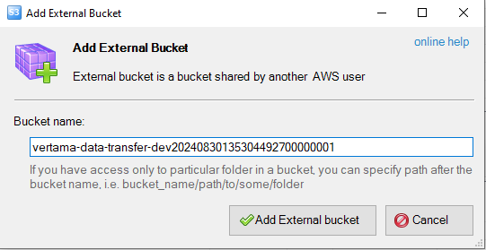
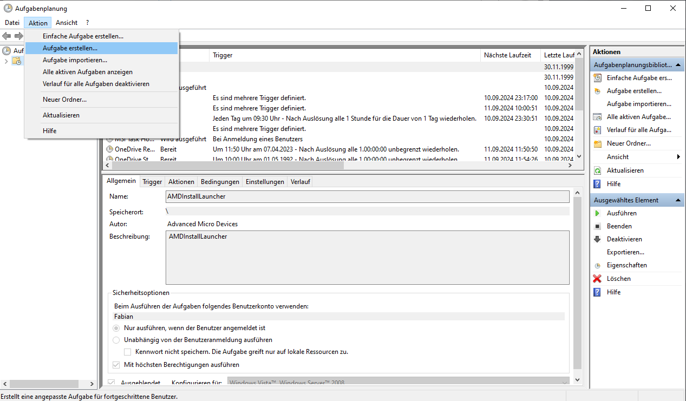
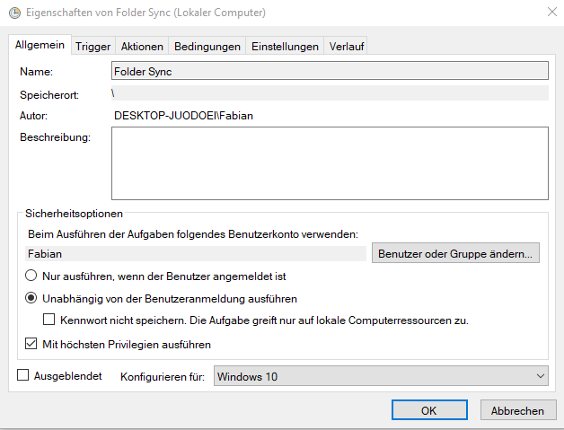
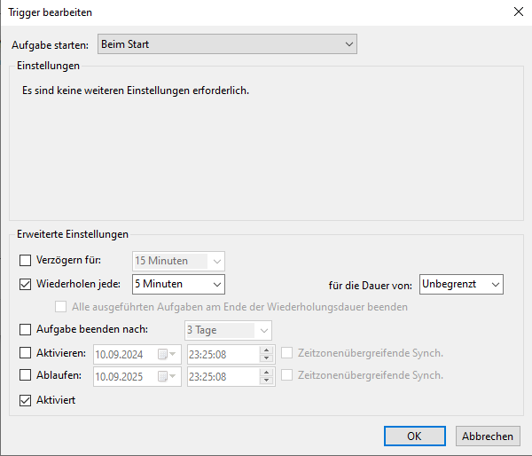
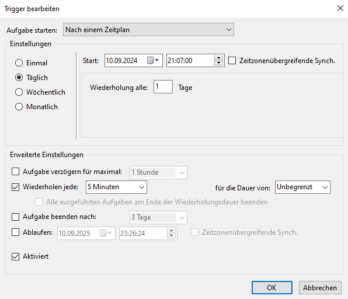
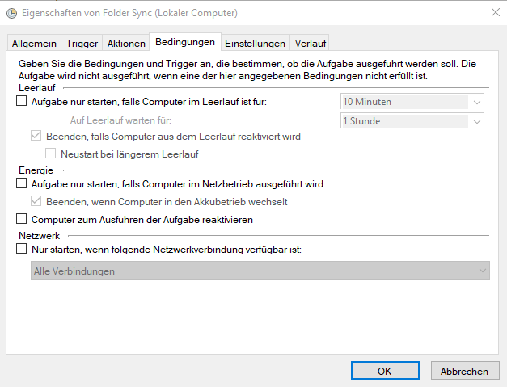

# Benutzerhandbuch: Folder Sync mit S3 Browser

## Inhaltsverzeichnis

- [1. Einleitung](#1-einleitung)
- [2. S3 Browser einrichten](#2-s3-browser-einrichten)
    - [2.1 S3 Browser herunterladen und installieren](#21-s3-browser-herunterladen-und-installieren)
    - [2.2 Account hinzufügen](#22-account-hinzufügen)
    - [2.3 Externen Bucket hinzufügen](#23-externen-bucket-hinzufügen)
- [3. Automatischen Sync konfigurieren](#3-automatischen-sync-konfigurieren)
    - [3.1 Aufgabenplaner öffnen](#31-aufgabenplaner-öffnen)
    - [3.2 Neue Aufgabe erstellen](#32-neue-aufgabe-erstellen)
    - [3.3 Allgemeine Einstellungen](#33-allgemeine-einstellungen)
    - [3.4 Trigger konfigurieren](#34-trigger-konfigurieren)
    - [3.5 Aktion definieren](#35-aktion-definieren)
    - [3.6 Bedingungen festlegen](#36-bedingungen-festlegen)
    - [3.7 Einstellungen anpassen](#37-einstellungen-anpassen)
- [4. Glossar](#4-glossar)

## 1. Einleitung

Dieses Handbuch führt Sie durch die Einrichtung eines automatischen Synchronisationsprozesses zwischen Ihrem lokalen Ordner und Amazon S3 Storage mithilfe des S3 Browsers. Der S3 Browser ist ein leistungsfähiges Tool, das die Verwaltung von Amazon S3-Ressourcen vereinfacht.

In den folgenden Abschnitten erfahren Sie Schritt für Schritt, wie Sie:
- Den S3 Browser installieren und konfigurieren
- Einen externen Bucket hinzufügen
- Einen automatischen Sync-Vorgang im Windows-Aufgabenplaner einrichten

Befolgen Sie die Anweisungen sorgfältig, um eine reibungslose und effiziente Datensynchronisation zu gewährleisten.

## 2. S3 Browser einrichten

### 2.1 S3 Browser herunterladen und installieren

1. Navigieren Sie zur offiziellen Website: https://s3browser.com/amazon-s3-folder-sync.aspx#options
2. Laden Sie die neueste Version des S3 Browsers herunter.
3. Führen Sie die Installation aus und notieren Sie sich den Installationspfad für spätere Schritte.

### 2.2 Account hinzufügen

1. Starten Sie den S3 Browser nach der Installation.
2. Fügen Sie den bereitgestellten Account hinzu:
    - Verwenden Sie den Access Key, der Ihnen zur Verfügung gestellt wurde.
    - Geben Sie den Secret Access Key ein, den Sie erhalten haben.


### 2.3 Externen Bucket hinzufügen

1. Fügen Sie den externen Bucket hinzu.
2. Verwenden Sie dafür den Bucket-Namen.



## 3. Automatischen Sync konfigurieren

### 3.1 Aufgabenplaner öffnen

Öffnen Sie den Windows-Aufgabenplaner durch Eingabe von "taskschd.msc" im Ausführen-Dialog (Windows-Taste + R).

### 3.2 Neue Aufgabe erstellen

Im Aufgabenplaner, wählen Sie in der linken oberen Ecke unter "Aktionen" die Option "Aufgabe erstellen..." aus.



### 3.3 Allgemeine Einstellungen

1. Geben Sie der Aufgabe einen aussagekräftigen Namen, z.B. "S3 Folder Sync".
2. Wählen Sie "Unabhängig von der Benutzeranmeldung ausführen" aus.
3. Wählen Sie die höchsten Berechtigungen aus ("Mit höchsten Privilegien ausführen").
4. Wählen Sie "Windows 10" als Konfiguration aus.



### 3.4 Trigger konfigurieren

1. Wechseln Sie zum Reiter "Trigger" und erstellen Sie zwei separate Trigger:

   a) Erster Trigger: "Beim Start"
    - Wählen Sie "Beim Start" aus dem Dropdown-Menü.
    - Stellen Sie unter "Erweiterte Einstellungen" ein:
        - Aktivieren Sie "Aufgabe alle:" und geben Sie "5 Minuten" ein.
        - Wählen Sie bei "Dauer" die Option "Unbegrenzt" aus.



   b) Zweiter Trigger: "Nach einem Zeitplan"
    - Wählen Sie unter "Aufgabe starten:" die Option "Nach einem Zeitplan" aus.
    - Wählen Sie bei "Einstellungen" die Option "Täglich".
    - Stellen Sie das Startdatum auf das aktuelle Datum und die Startzeit auf einen Zeitpunkt ein, der wenige Minuten in der Zukunft liegt. Dies ist wichtig, damit der Trigger garantiert in der Zukunft liegt und sofort aktiv wird.
      Beispiel: Wenn es jetzt 14:30 Uhr ist, stellen Sie die Startzeit auf 14:35 Uhr ein.
    - Wählen Sie bei "Dauer" die Option "Unbegrenzt" aus.



2. Bestätigen Sie jeden Trigger mit "OK".

### 3.5 Aktion definieren

1. Wechseln Sie zum Reiter "Aktionen" und wählen Sie "Neu..." aus.
2. Wählen Sie "Programm starten" aus dem Dropdown-Menü aus.
3. Geben Sie im Feld "Programm/Skript" den vollständigen Pfad zum S3 Browser CLI ein:
   ```
   "C:\Program Files\S3 Browser\s3browser-cli.exe"
   ```
4. Fügen Sie im Feld "Argumente hinzufügen" folgenden Befehl ein:
   ```
   /file sync vertama-data-transfer-dev20240830135304492700000001 "C:\Ihr\Lokaler\Ordner" "s3:vertama-data-transfer-dev20240830135304492700000001/New Folder/" ncdhs
   ```
   Ersetzen Sie "C:\Ihr\Lokaler\Ordner" mit dem tatsächlichen Pfad des zu synchronisierenden Ordners.


### 3.6 Bedingungen festlegen

Wechseln Sie zum Reiter "Bedingungen" und deaktivieren Sie alle Optionen unter "Energie", um den Sync auch im Batteriebetrieb zu ermöglichen.



### 3.7 Einstellungen anpassen

Wechseln Sie zum Reiter "Einstellungen" und nehmen Sie folgende Anpassungen vor:

1. Aktivieren Sie nur diese Optionen:
    - "Aufgabe so schnell wie möglich nach einem verpassten Start ausführen"
    - "Falls Aufgabe scheitert, neu starten alle:"
2. Deaktivieren Sie alle anderen Optionen.


Klicken Sie abschließend auf "OK", um die Aufgabe zu speichern und zu aktivieren.

## 4. Glossar

- **S3 Browser**: Verwaltungstool für Amazon S3 und kompatible Speicherdienste.
- **Amazon S3**: Skalierbarer Cloudspeicherdienst von AWS (Amazon Web Services)
- **Bucket**: Container für Dateien in Amazon S3.
- **Access Key**: Identifikationsschlüssel für AWS-Dienste.
- **Secret Access Key**: Geheimer Authentifizierungsschlüssel für AWS.
- **Aufgabenplaner**: Windows-Tool zur Aufgabenautomatisierung.
- **Trigger**: Definierter Auslöser für geplante Aufgaben.
- **Sync**: Datenabgleich zwischen zwei Speicherorten.
